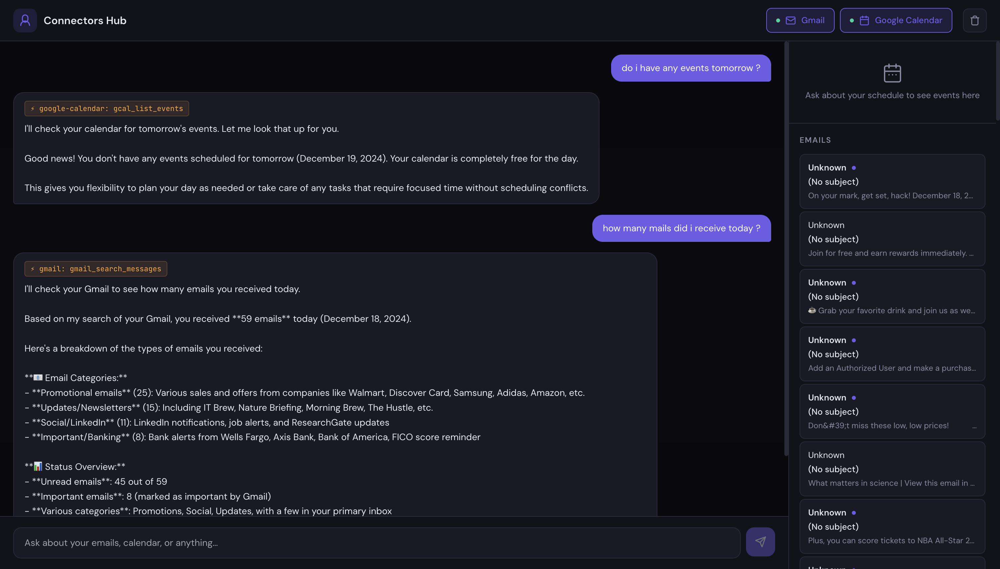

# Claude Connectors Hub

A productivity dashboard that connects Claude AI to your Gmail and Google Calendar via **MCP (Model Context Protocol)** — type natural language queries and Claude fetches real data from your accounts.



> Asking "how many mails did I receive today?" — Claude calls the Gmail MCP server and returns a live breakdown: 59 emails across promotional, newsletters, social, and important categories. Calendar events and email previews populate the right sidebar automatically.


---

## What This Demonstrates

This project is built to showcase real-world usage of **Claude's API with MCP Connector support** — a beta feature that lets Claude call external services (Gmail, Google Calendar) directly via hosted MCP servers.

| Skill | Implementation |
|---|---|
| **Claude API + MCP Connectors** | `mcp_servers` + `mcp_toolset` in `/v1/messages` with `anthropic-beta: mcp-client-2025-11-20` |
| **OAuth 2.0 PKCE** | Full browser-based auth flow with dynamic client registration, no backend required |
| **MCP Response Parsing** | Filtering `mcp_tool_use` / `mcp_tool_result` blocks by type, never by index |
| **Multi-turn Conversations** | Conversation history management across API calls |
| **Custom React Hooks** | `useClaude`, `useOAuth` — clean separation of API and auth logic |
| **Popup-based OAuth** | `window.postMessage` bridge between popup and parent window |

---

## How It Works

### 1. MCP Connector API Pattern

This is the core integration. Claude receives access to external tools by passing `mcp_servers` and `tools` (with `mcp_toolset` entries) in the request body:

```javascript
const response = await fetch("https://api.anthropic.com/v1/messages", {
  method: "POST",
  headers: {
    "x-api-key": ANTHROPIC_API_KEY,
    "anthropic-version": "2023-06-01",
    "anthropic-beta": "mcp-client-2025-11-20",        // required for MCP
    "anthropic-dangerous-direct-browser-access": "true",
  },
  body: JSON.stringify({
    model: "claude-sonnet-4-20250514",
    messages: [{ role: "user", content: "What meetings do I have today?" }],
    mcp_servers: [
      {
        type: "url",
        url: "https://gcal.mcp.claude.com/mcp",
        name: "google-calendar",
        authorization_token: GOOGLE_OAUTH_TOKEN,      // from OAuth flow below
      }
    ],
    tools: [
      { type: "mcp_toolset", mcp_server_name: "google-calendar" }  // must match name above
    ]
  })
});
```

### 2. Parsing MCP Responses

Response blocks are filtered by `type` — never by array index:

```javascript
const blocks = response.content;

const text       = blocks.filter(b => b.type === "text");
const toolCalls  = blocks.filter(b => b.type === "mcp_tool_use");
const toolResults = blocks.filter(b => b.type === "mcp_tool_result");
```

### 3. OAuth 2.0 PKCE — No Backend Required

The Gmail and Calendar MCP servers require a Google OAuth token. This app implements the full OAuth flow in the browser using **PKCE + dynamic client registration** via a popup window:

```
User clicks connector toggle
        │
        ▼
POST /register → get client_id + client_secret
        │
        ▼
Generate code_verifier + SHA-256 code_challenge (PKCE)
        │
        ▼
Open popup → /authorize?code_challenge=...&client_id=...
        │
        ▼
User approves Google account access
        │
        ▼
Popup redirects to app origin (?code=...)
        │
        ▼
App detects window.opener + code param
→ postMessage({ type: "oauth_callback", code }) to parent
→ popup closes
        │
        ▼
Parent: POST /token with code + code_verifier
        │
        ▼
Receive access_token → pass as authorization_token in MCP requests
```

All PKCE state lives in a React ref — no `localStorage` or `sessionStorage` needed.

---

## Architecture

```
src/
├── components/
│   ├── App.jsx               # Layout shell + OAuth callback detection
│   ├── CommandCenter.jsx     # Chat thread + input
│   ├── ConnectorStatus.jsx   # Toggle buttons with auth state (idle/pending/authenticated/error)
│   ├── CalendarPanel.jsx     # Renders extracted calendar events
│   └── EmailPanel.jsx        # Renders extracted email summaries
├── hooks/
│   ├── useClaude.js          # Conversation state, connector toggling, API calls
│   └── useOAuth.js           # OAuth PKCE flow, token state, popup + postMessage bridge
└── utils/
    ├── claudeApi.js          # Anthropic API client — all MCP config lives here
    ├── parseResponse.js      # Parses mcp_tool_use / mcp_tool_result blocks
    └── oauth.js              # PKCE helpers, client registration, token exchange
```

---

## Getting Started

### Prerequisites

- Node.js 18+
- [Anthropic API key](https://console.anthropic.com/)

### Installation

```bash
git clone https://github.com/YOUR_USERNAME/claude-connectors-hub.git
cd claude-connectors-hub
npm install
cp .env.example .env
# Add VITE_ANTHROPIC_API_KEY to .env
npm run dev
```

### Connecting Gmail & Calendar

No manual token setup needed. When you click a connector toggle, the app automatically:

1. Registers itself as an OAuth client with the MCP server
2. Opens a popup for Google account authorization
3. Exchanges the auth code for an access token
4. Passes the token in all subsequent MCP requests

Tokens are held in React state for the session. Re-authorizing is one click away via the **Retry** button if a token expires.

### Environment Variables

```env
VITE_ANTHROPIC_API_KEY=sk-ant-...
```

> **Security:** This project calls the Anthropic API directly from the browser (using the `anthropic-dangerous-direct-browser-access` header) for demonstration purposes. In production, proxy requests through a backend server.

---

## Example Queries

```
Summarize my unread emails from today
What meetings do I have this week?
Find a free 30-minute slot tomorrow afternoon
Draft a reply to the latest email from the engineering team
Do I have any conflicts with the Q3 planning meeting?
```

---

## Tech Stack

- **React 18** — functional components, hooks only
- **Vite 5** — dev server and bundling
- **Tailwind CSS 3** — layout utilities
- **Anthropic Claude API** — `claude-sonnet-4-20250514` with `mcp-client-2025-11-20` beta
- **MCP Servers** — `gmail.mcp.claude.com`, `gcal.mcp.claude.com`
- No UI component libraries — all components hand-built

---

## Tools Used

- **[Claude](https://claude.ai)** — AI assistant used to help design and build this project

---

## Learn More

- [Anthropic MCP Connector Docs](https://docs.anthropic.com/en/agents-and-tools/mcp-connector)
- [Claude API Reference](https://docs.anthropic.com/en/api)
- [Model Context Protocol Spec](https://modelcontextprotocol.io)

---

## License

MIT
